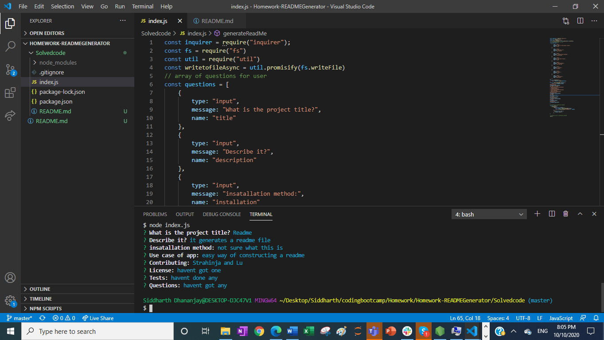

# README Generator
## Description
This application is able to generate a readme through user input. A user will be prompted to type in content such as what the desired title of the project is, a brief description of the project, the installation method and a usecase of the app to name some, and after he is done filling in the prompts a readme file will be generated with the text being situated correctly under headings.

The user interaction is possible due to the of the npm inquire, and the typed up answers being posted into a readme file is due to the node fs module that is utilised. 
## Image

## Link
https://github.com/sid-666/READMEGenerator
